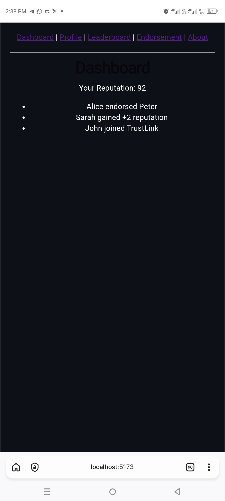
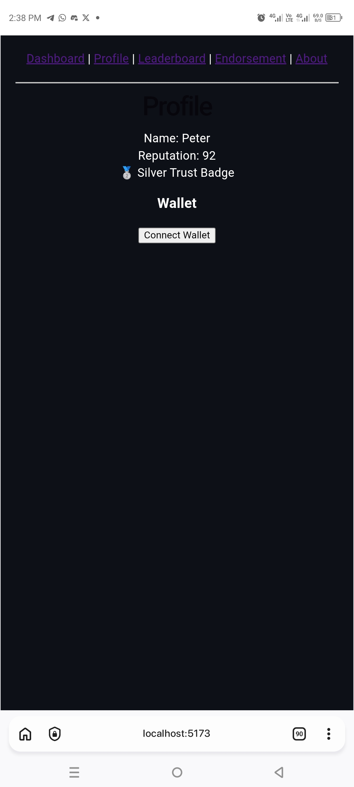
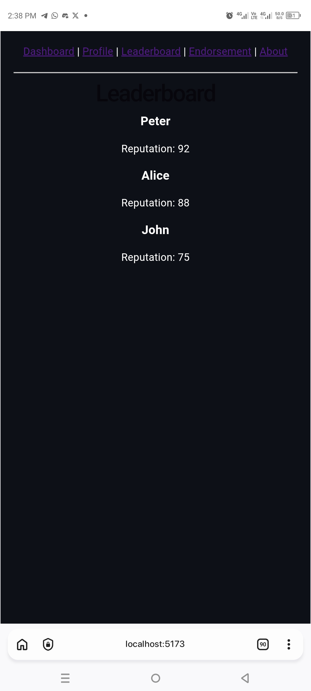
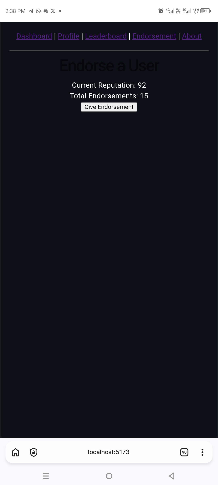

# TrustLink

A decentralized reputation platform built on Canopy where users create profiles, endorse others, and build on-chain trust.

## Overview

TrustLink is a Web3-native reputation system that leverages blockchain technology to create immutable, transparent endorsements and trust metrics. By combining user profiles with on-chain verification, TrustLink enables individuals and organizations to build verifiable reputations in decentralized networks.

Whether you're a creator, investor, developer, or community member, TrustLink helps you:
- **Establish credibility** through peer endorsements
- **Verify trustworthiness** using on-chain records
- **Build reputation** within decentralized communities
- **Make informed connections** based on transparent metrics

## Features

### 🔐 User Profiles
- Create and customize your Web3 identity
- Link multiple wallet addresses
- Showcase your achievements and credentials
- Set privacy preferences for profile data

### 📝 On-Chain Endorsements
- Give and receive cryptographically signed endorsements
- Endorse others in specific skills or domains
- Create permanent records on the blockchain
- Build verifiable trust networks

### ⭐ Reputation Scores
- Earn reputation points through quality endorsements
- Track reputation growth over time
- Multi-dimensional scoring (technical, community, reliability, etc.)
- Weighted scoring based on endorser reputation

### 🏆 Leaderboards
- Discover top-ranked community members
- Filter leaderboards by reputation category
- View trending profiles
- Benchmark your reputation against peers

### 💼 Wallet Integration
- Seamless Web3 wallet connectivity
- Support for major Canopy-compatible wallets
- Secure transaction signing for endorsements
- Direct blockchain interaction

## Architecture

### Technology Stack

```
Frontend
├── User Interface (React/Vue.js)
├── Web3 Wallet Integration
└── Real-time Reputation Dashboard

Smart Contracts
├── User Profile Management
├── Endorsement System
├── Reputation Calculation
└── Governance & Incentives

Canopy Blockchain
├── Immutable Records
├── Transaction Verification
└── State Management
```

### Core Components

**Smart Contracts**
- `UserProfile.sol` - Manages user profiles and metadata
- `Endorsement.sol` - Handles endorsement creation and validation
- `Reputation.sol` - Calculates and tracks reputation scores
- `Leaderboard.sol` - Maintains ranked lists by category

**Backend Services**
- Profile indexing service
- Reputation calculation engine
- Leaderboard aggregation
- Event listener and synchronization

**Frontend Application**
- React/Vue.js web application
- Wallet connection and authentication
- Profile management interface
- Endorsement and discovery features
- Analytics and dashboard views

## Installation

### Prerequisites

- Node.js (v16.0 or higher)
- npm or yarn package manager
- Canopy wallet (MetaMask, Phantom, or compatible)
- Git

### Clone the Repository

```bash
git clone https://github.com/peterkehinde673/trustlink-socialfi.git
cd trustlink-socialfi
```

### Install Dependencies

```bash
npm install
# or
yarn install
```

### Configure Environment Variables

Create a `.env.local` file in the project root:

```env
REACT_APP_RPC_URL=https://mainnet.canopy.chain
REACT_APP_CONTRACT_ADDRESS=0x...
REACT_APP_NETWORK_ID=1
```

### Run Development Server

```bash
npm run dev
# or
yarn dev
```

The application will be available at `http://localhost:3000`

### Build for Production

```bash
npm run build
# or
yarn build
```

### Deploy Smart Contracts

```bash
# Compile contracts
npm run contracts:compile

# Deploy to Canopy testnet
npm run contracts:deploy:testnet

# Deploy to Canopy mainnet
npm run contracts:deploy:mainnet
```

## Roadmap

### Phase 1: MVP (Q2 2026)
- ✅ User profile creation and management
- ✅ Basic endorsement system
- ✅ Wallet integration
- ⚠️ Simple reputation scoring
- ⚠️ Basic leaderboards

### Phase 2: Enhanced Features (Q3 2026)
- [ ] Multi-category endorsements
- [ ] Advanced reputation algorithms
- [ ] Community governance
- [ ] Reputation badges and achievements
- [ ] Social discovery features

### Phase 3: Ecosystem Integration (Q4 2026)
- [ ] DAO integration for community governance
- [ ] Third-party API for reputation verification
- [ ] Mobile application
- [ ] Cross-chain reputation bridges
- [ ] Reputation-based incentive programs

### Phase 4: Scaling & Optimization (2027)
- [ ] Layer 2 scaling solutions
- [ ] Advanced analytics dashboard
- [ ] AI-powered trust recommendations
- [ ] Institutional partnerships
- [ ] Global expansion

## Getting Help

### Documentation
- [Full Documentation](./docs/)
- [API Reference](./docs/API.md)
- [Smart Contract Docs](./docs/CONTRACTS.md)

### Community & Support
- **GitHub Issues** - Report bugs or request features
- **Discussions** - Join community conversations
- **Discord** - Connect with team and community members
- **Twitter** - Follow for announcements and updates

## Contributing

We welcome contributions from the community! Please follow these steps:

1. Fork the repository
2. Create a feature branch (`git checkout -b feature/amazing-feature`)
3. Commit your changes (`git commit -m 'Add amazing feature'`)
4. Push to the branch (`git push origin feature/amazing-feature`)
5. Open a Pull Request

Please read [CONTRIBUTING.md](./CONTRIBUTING.md) for our code of conduct and detailed contribution guidelines.

## Security

TrustLink prioritizes security and transparency. We:
- Conduct regular smart contract audits
- Follow industry best practices for Web3 security
- Welcome responsible security disclosures
- Maintain a bug bounty program

For security concerns, please email security@trustlink.io instead of using GitHub issues.

## License

This project is licensed under the MIT License - see the [LICENSE](./LICENSE) file for details.

## Acknowledgments

- Built on [Canopy](https://canopy.chain) blockchain
- Thanks to our community contributors
- Inspired by decentralized identity and reputation standards

## Screenshots

### Dashboard



### Profile



### Leaderboard



### Endorsement


---

**Made with ❤️ by the TrustLink Team**

For more information, visit [trustlink.io](https://trustlink.io) or reach out to the community.
